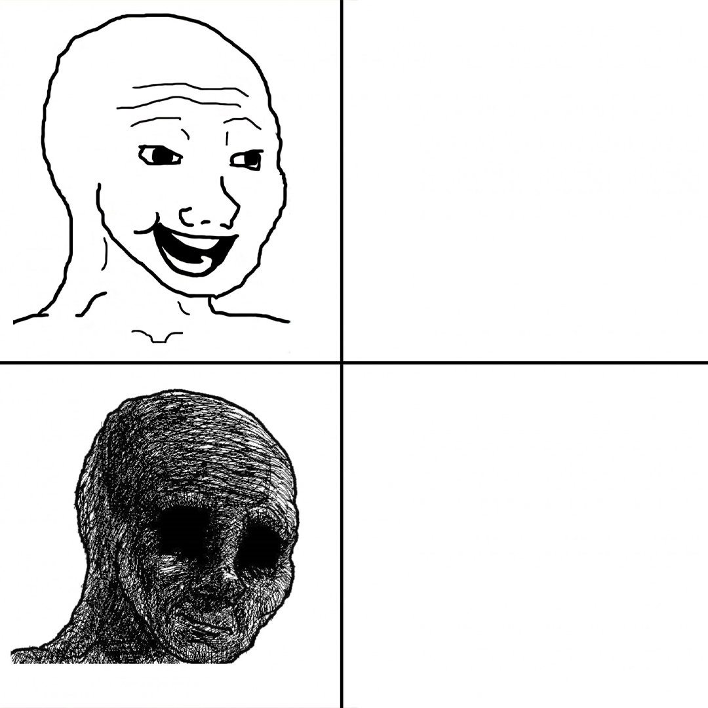

<div align="center">
  
  <h1>Termeme</h1>
  <p>Create memes directly in your terminal!</p>
</div>

When I say create memes directly in your terminal, I mean it! This meme generator will create your meme without ever leaving your terminal. Termeme is a command-line utility, and library, so feel free to customize as much as you want.

Check out this iTerm2 example:


## Usage

This CLI/library is available on npm:

```bash
npm i --global termeme
```

You'll find examples under the `examples/` directory, but if you just want to plug-and-play, here's a minimal blank example:

```javascript
import TerminalMeme from "termeme"

const { meme } = await TerminalMeme({
    input: "",
    top: "",
    bottom: ""
})

console.log(meme)
```

Beyond that, here's an all-inclusive list of the available options to customize your dream meme:

| Option        | Description                                                                                     | Example                          |
| ------------- | ----------------------------------------------------------------------------------------------- | -------------------------------- |
| `input`       | Provide the source image for the meme                                                           | "./templates/WojackTemplate.jpg" |
| `top`         | The text to display at the top of your meme                                                     | "Generating memes!"              |
| `bottom`      | The text to display at the bottom of your meme                                                  | "It's not in a terminal..."      |
| `template`    | Define which template you want to use (check the [templates](#templates)) for available options | "comparison"                     |
| `save`        | Save the created meme to an image                                                               | "wojackmeme_Termeme.jpg"         |
| `stroke`      | Add a stroke line to the generated text                                                         | 4                                |
| `fontfamily`  | Specify a font for the text                                                                     | "Fira Code, Arial"               |
| `color`       | Choose a hexedecimal color for the text                                                         | "#FFFFFF"                      |
| `strokecolor` | Choose a hexadecimal color for the stroke                                                       | "#000000"                      |
| `fontscale`   | Change the font size of the text                                                                | 0.05                             |

These examples are pulled directly from the `examples/make-meme.js` example.

## Templates

You can pass in any of these templates to the `template` argument to change how the image is rendered. The main reason for this is to change how the text is rendered onto the image. For example, `classic` is rendered on top/bottom in the center, while `comparison` is rendered on top/bottom on the right side of the image as these are some of the more popular types of meme layouts.

| Template     | Example                                        |
| ------------ | ---------------------------------------------- |
| `classic`    |  |
| `comparison` |     |

> [!NOTE]
> If your image is blurry or heavily pixelated in the terminal, this is due to the underlying `terminal-image` library. I plan to eventually look into improved visuals for terminals outside of iTerm2, but don't worry, this does not affect the actual image quality if you export it.
