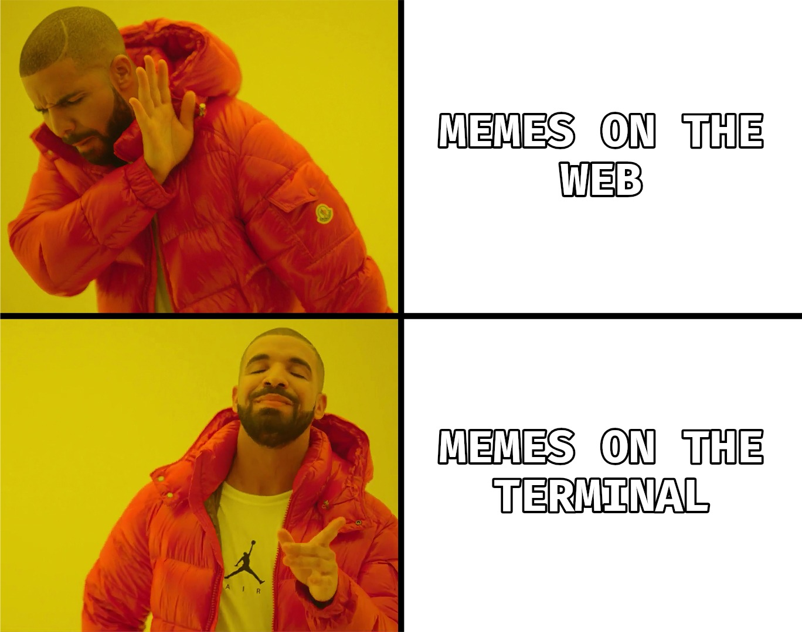
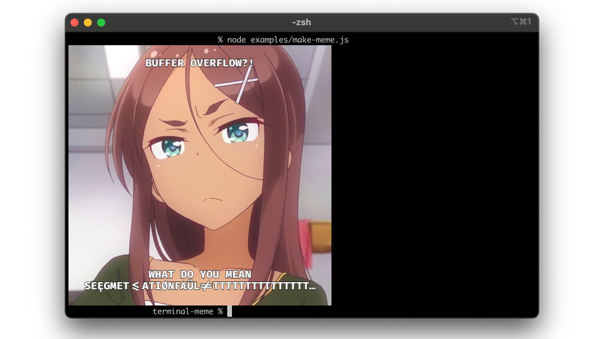
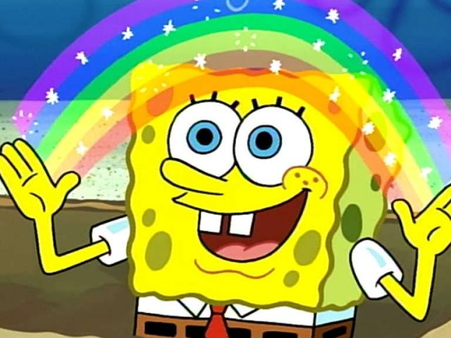
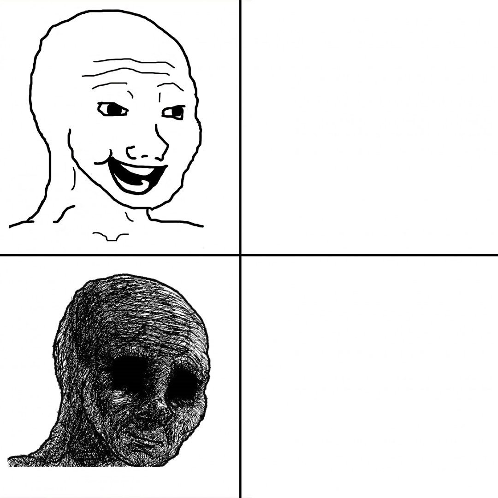
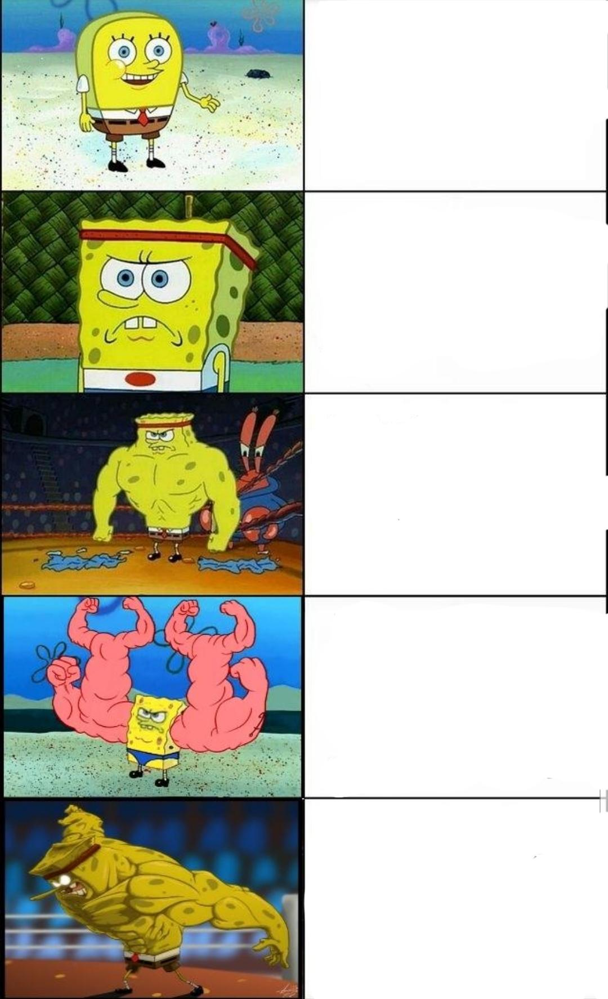

<div align="center">
  
  <h1>Termeme</h1>
  <p>Create memes directly in your terminal!</p>
</div>

When I say create memes directly in your terminal, I mean it! This meme generator will create your meme without ever leaving your terminal. Termeme is a command-line utility, and library, so feel free to customize as much as you want. And don't worry, there's no watermark!

> [!IMPORTANT]
> It's officially Hacktoberfest! For anyone looking to submit issues, pull requests, or any other contributions, feel free to submit here! This project has way more formats that could be implemented (memes are infinite), so feel free to contribute! I've added a few issues myself if you want to tackle those, but you can also add other features you think would be interesting.

NOTE: This is a small project, so a contribution guide isn't explicilty set. All I ask is that you create an issue before you create a pull request. Also, there is a provided `.prettierrc` config, you can run this using the following command:

```bash
npm run pretty
```

If you make any updates, please also update the `index.d.ts` types file accordingly. This isn't required, but it would help me a lot with getting a new release out quicker.

## Usage

This CLI/library is available on npm:

```bash
npm i --global termeme
```

No "Graphics Magick", third-party dependencies, or external applications! Plus an easy to use object-based library!

### Library

You'll find examples under the `examples/` directory, but if you just want to plug-and-play, here's a minimal blank example:

```javascript
import { TerminalMeme } from "termeme"

const { meme } = await TerminalMeme({
    input: "",
    topText: "",
    bottomText: ""
})

console.log(meme)
```

### Command Line

All options in the library are also available via the CLI. This example shows the `examples/basic-wojack-meme.js` in CLI form:

```bash
termeme --input "layouts/WojackTemplate.jpg" \
--top-text "Generating memes" --bottom-text "It's not in a terminal..." \
--layout "comparison" --save-img "wojackmeme_termeme.jpg" --stroke 4 \
--font-family "Fira Code, Arial" --font-color "#FFFFFF" --stroke-color "#000000" --font-size 0.05
```

Here's a multi-line example as well for the `multicomparison` layout:

```bash
termeme --input "layouts/SpongebobFiveTemplate.jpg" \
--rows "Intern" "1x Engineer" "5x Engineer" "10x Engineer" "Unemployed" \
--layout "multicomparison" --save-img "spongebob_five_termeme.jpg" --stroke 4 \
--font-family "Fira Code, Arial" --font-color "#FFFFFF" --stroke-color "#000000" --font-size 0.03
```

Beyond that, here's an all-inclusive list of the available options to customize your dream meme:

| Option          | Description                                                                               | Example                           |
| --------------- | ----------------------------------------------------------------------------------------- | --------------------------------- |
| `--input`       | Provide the source image for the meme                                                     | "./layouts/WojackTemplate.jpg"    |
| `--top-text`     | The text to display at the top of your meme                                               | "Generating memes!"               |
| `--bottom-text`  | The text to display at the bottom of your meme                                            | "It's not in a terminal..."       |
| `--layout`      | Define which layout you want to use (check the [layouts](#layouts)) for available options | "comparison"                      |
| `--save-img`     | Save the created meme to an image                                                         | "wojackmeme_Termeme.jpg"          |
| `--stroke`      | Add a stroke line to the generated text                                                   | 4                                 |
| `--font-family`  | Specify a font for the text                                                               | "Fira Code, Arial"                |
| `--font-color`   | Choose a hexedecimal color for the text                                                   | "#FFFFFF"                       |
| `--stroke-color` | Choose a hexadecimal color for the stroke                                                 | "#000000"                       |
| `--font-size`    | Change the font size of the text                                                          | 0.05                              |
| `--rows`        | Text for multi-line layouts                                                               | "One" "Two" "Three" "Four" "Five" |

Here's a small test I ran in iTerm2:



## Layouts

You can pass in any of these layouts to the `layout` argument to change how the image is rendered. The main reason for this is to change how the text is rendered onto the image. For example, `classic` is rendered on top/bottom in the center, while `comparison` is rendered on top/bottom on the right side of the image as these are some of the more popular types of meme layouts.

| Layout            | Example                                                                                   |
| ----------------- | ----------------------------------------------------------------------------------------- |
| `classic`         | <div align="center"></div>         |
| `comparison`      | <div align="center"></div>            |
| `multicomparison` | <div align="center"></div> |

> [!NOTE]
> If your image is blurry or heavily pixelated in the terminal, this is due to the underlying `terminal-image` library. I plan to eventually look into improved visuals for terminals outside of iTerm2, but don't worry, this does not affect the actual image quality if you export it.
